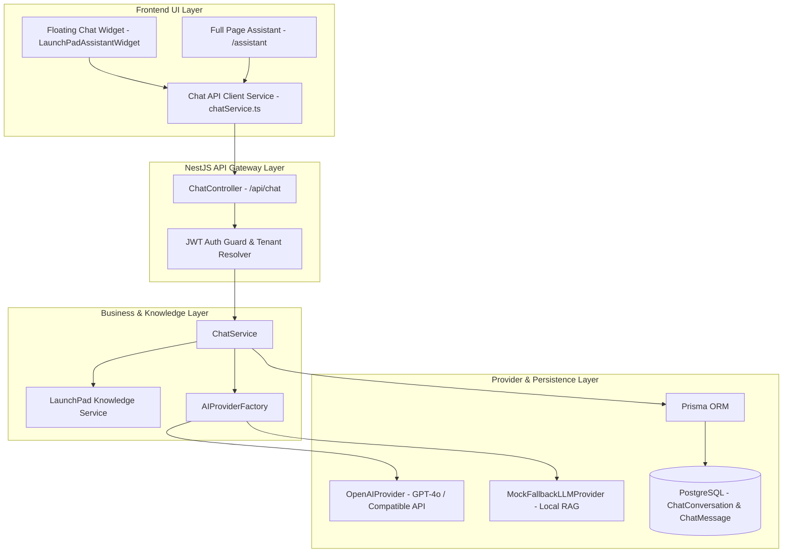

# LaunchPad Assistant — Developer & Operational Guide

**Version:** `v1.0.0-production-enhancement`  
**Feature:** LaunchPad Assistant AI Chatbot & Knowledge Engine  
**Module:** `/backend/src/chat` & `/src/components/chat`

---

## 1. Overview

**LaunchPad Assistant** is an integrated AI chatbot and knowledge retrieval engine built directly into the LaunchPad SaaS OS. It assists users with creating applications, configuring modules, setting up Integration Hub connectors, managing multi-tenant RBAC permissions, and troubleshooting platform errors.

LaunchPad Assistant uses a **Modular AI Provider Architecture** with strict multi-tenant isolation, JWT security, context truncation, sensitive key stripping, and automatic fallback to an offline Knowledge Engine when no third-party API key is configured.

---

## 2. System Architecture



---

## 3. Environment Configuration

Configure the AI Provider via standard environment variables in `backend/.env.production`:

| Variable Name | Required | Default | Description |
| :--- | :---: | :--- | :--- |
| `AI_PROVIDER` | No | `fallback` | Active provider (`openai`, `azure_openai`, `fallback`). |
| `AI_API_KEY` | Conditional | `null` | Secret API key for external LLM provider. |
| `AI_MODEL` | No | `gpt-4o-mini` | Target LLM model name. |
| `AI_BASE_URL` | No | `https://api.openai.com/v1` | Base REST URL for OpenAI-compatible APIs. |

> 🔒 **Security Note**: Never commit actual `AI_API_KEY` values to source control. The fallback engine (`MockFallbackLLMProvider`) will operate seamlessly without external keys.

---

## 4. REST API Endpoints

All endpoints require a valid JWT Bearer token header (`Authorization: Bearer <TOKEN>`).

### 1. Send Chat Message
- **Endpoint**: `POST /api/chat`
- **Payload**:
  ```json
  {
    "message": "How do I create an application?",
    "conversationId": "optional-uuid",
    "context": { "currentRoute": "/dashboard" }
  }
  ```
- **Response**:
  ```json
  {
    "conversationId": "conv-uuid-101",
    "title": "How do I create an application?",
    "userMessage": { "id": "msg-1", "role": "user", "content": "..." },
    "assistantMessage": { "id": "msg-2", "role": "assistant", "content": "..." }
  }
  ```

### 2. Stream Chat Message (SSE)
- **Endpoint**: `POST /api/chat/stream`
- **Content-Type**: `text/event-stream`

### 3. List User Conversations
- **Endpoint**: `GET /api/chat/conversations`

### 4. Get Conversation Details
- **Endpoint**: `GET /api/chat/conversations/:id`

### 5. Delete Conversation
- **Endpoint**: `DELETE /api/chat/conversations/:id`

---

## 5. Security & Multi-Tenant Isolation

1. **Tenant Boundaries**: `ChatConversation` records store `organizationId` and `userId`. Every query checks `conversation.organizationId === user.organizationId`. Cross-tenant queries return `403 Forbidden`.
2. **Sensitive Secret Stripping**: `LaunchPadKnowledgeService` automatically strips `password`, `jwtSecret`, `apiKey`, and `stripeKey` before sending context payloads.
3. **Audit Logging**: Interactions trigger system audit logs recorded under action `CHAT_ASSISTANT_INTERACTION`.

---

## 6. Troubleshooting

- **Falling back to Knowledge Engine**: If `AI_API_KEY` is invalid or unreachable, the system logs a warning and falls back to local knowledge retrieval without failing user requests.
- **Prisma Schema Validation**: Run `npx prisma validate` and `npx prisma generate` after modifying chat models.
