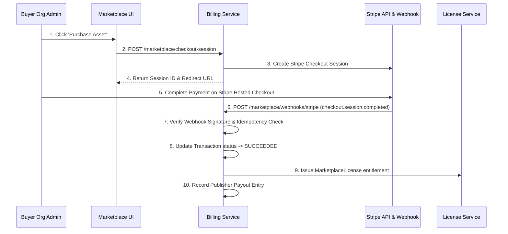

# LaunchPad OS — Marketplace Monetization & Billing Notes

**Version:** `v1.0.0-production`  

---

## 1. Monetization Architecture

LaunchPad supports a publisher monetization engine using Stripe Checkout and Webhook Events (`MarketplaceBillingService`):

- **Pricing Types**: `FREE`, `ONE_TIME`, `SUBSCRIPTION`.
- **Commission Split**: Configurable platform commission rate (`PLATFORM_COMMISSION_RATE` default: 0.15 = 15%).
- **Publisher Payouts**: Automated calculation and logging of publisher net earnings on completed transactions.

---

## 2. Webhook Event Processing Flow

---

## 3. Webhook Security & Idempotency Rules

- **Signature Verification**: Verified against `STRIPE_WEBHOOK_SECRET`.
- **Idempotency**: Webhook events check `marketplaceTransaction.findFirst({ where: { stripeSessionId } })`. If status is already `SUCCEEDED`, the handler returns `{ received: true, alreadyProcessed: true }` without duplicating licenses or payouts.
