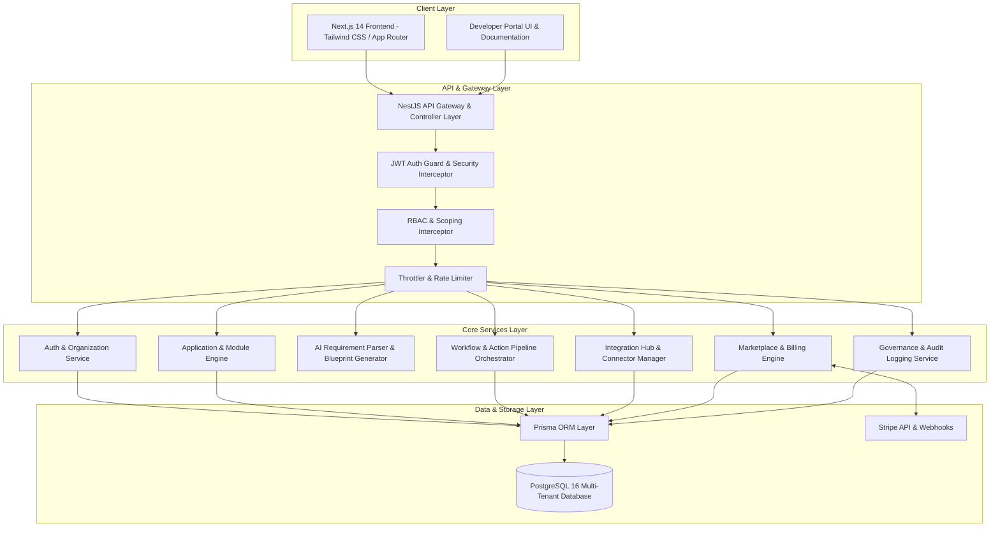

# LaunchPad SaaS OS — V1 Architecture Overview

**Version:** `v1.0.0-production`  
**Date:** September 17, 2026  
**Status:** Production Release Baseline  

---

## 1. System Vision & Core Objectives

LaunchPad SaaS OS is an enterprise-grade multi-tenant platform designed to enable organizations to rapidly generate, customize, execute, and monetize cloud-native software applications. 

The platform decouples business logic, data models, UI components, workflow pipelines, and third-party integrations into dynamic, declarative configurations driven by an AI Blueprint Engine and a visual visual builder interface.

---

## 2. High-Level Architecture Diagram

---

## 3. Subsystem Architecture Breakdown

### 3.1 Authentication & Multi-Tenant Scoping
- **Identity & JWT**: Stateless JSON Web Tokens (JWT) signed with HMAC-SHA256 (`JWT_SECRET`).
- **Tenant Isolation**: Every database record (Applications, Workflows, Integrations, Licenses, Audit Logs) enforces strict `organizationId` foreign key bindings.
- **RBAC Matrix**: Enforces 5 system roles (`SUPER_ADMIN`, `ORG_ADMIN`, `DEVELOPER`, `USER`, `VIEWER`).

### 3.2 Dynamic Application & Module System
- Applications are represented declaratively via JSON module metadata structures (`FORM`, `TABLE`, `KANBAN`, `ANALYTICS`, `WORKFLOW`).
- Supports application lifecycle modes: `DRAFT`, `PUBLISHED`, `ARCHIVED`.

### 3.3 AI Blueprint Generator
- Accepts natural language requirement prompts (e.g., *"Build a Visitor Management app with host notifications"*).
- Synthesizes app structure, module fields, status workflows, and recommended automated actions.

### 3.4 Workflow Engine
- Executes event-driven and scheduled automation pipelines.
- Evaluates rule conditions using boolean logic and executes actions (`HTTP_REQUEST`, `EMAIL_NOTIFICATION`, `DATABASE_UPDATE`, `WEBHOOK_TRIGGER`).

### 3.5 Integration Hub
- Standardized connector interface (`REST_API`, `OAUTH2`, `API_KEY`).
- Encrypts third-party API credentials at rest using AES-256-GCM encryption (`ENCRYPTION_KEY`).

### 3.6 Marketplace & Monetization
- Catalog of reusable applications, modules, workflows, and integrations.
- Integrated security scanning (`MarketplaceSecurityService`) to check for malicious payloads prior to asset publication.
- Stripe Monetization (`MarketplaceBillingService`) supporting one-time purchases and recurring subscriptions.
- Configurable platform revenue-share commission (default 15%).
- Automated license entitlement tracking (`MarketplaceLicense`) and safe sandboxed asset installation.

### 3.7 Governance & Audit Logging
- Immutable audit log trail (`AuditLogsService`) recording user actions, IP addresses, resource IDs, and timestamps.
- System health probes (`/health/liveness`, `/health/readiness`) for container orchestration.
