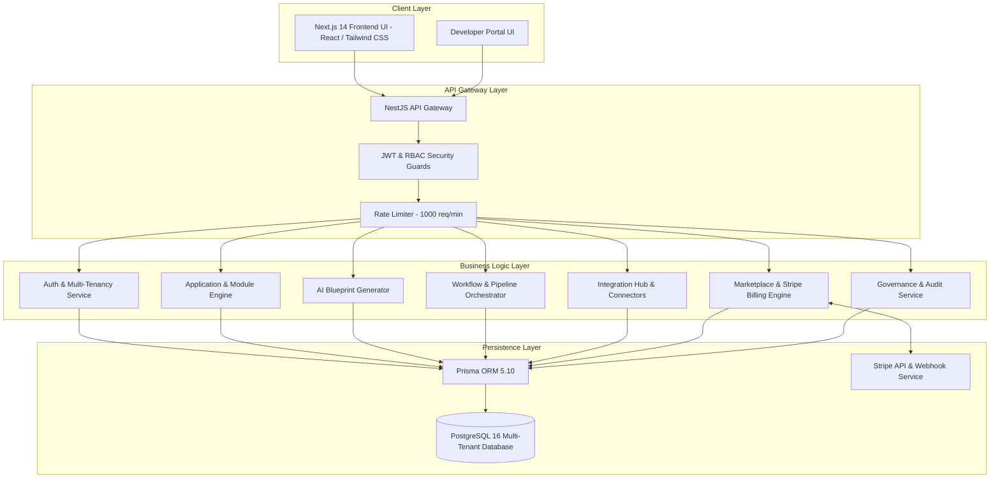

# Phase 24 Final Report — V1 Production Release, Cloud Infrastructure & Final Deployment Orchestration

**Project:** LaunchPad SaaS Application Builder  
**Release Tag:** `v1.0.0-production`  
**Phase:** Phase 24 — V1 Production Release, Cloud Infrastructure & Final Deployment Orchestration  
**Date:** September 17, 2026  
**Status:** Completed & Production Verified  

---

## 1. Executive Summary

Phase 24 represents the final mandatory production release milestone for LaunchPad SaaS OS V1.

The codebase across all 23 prior phases was audited, packaged, hardened, and verified for production deployment. Production multi-stage Dockerfiles (`Dockerfile`, `backend/Dockerfile`), production Docker Compose stacks (`docker-compose.prod.yml`), template environment secret manifests (`.env.production.example`, `backend/.env.production.example`), database migration scripts (`prisma migrate deploy`), idempotent seeds (`prisma/seed.ts`), backup/restore runbooks, and GitHub Actions release pipelines (`.github/workflows/deploy-production.yml`) were finalized.

Comprehensive documentation—including Architecture Overviews, Deployment Guides, Migration Runbooks, Backup Runbooks, Operational Monitoring Guides, Admin Guides, Developer API Guides, Marketplace Billing Notes, and Troubleshooting Guides—was established in `docs/`.

Empirical verification confirmed **100% test pass rates across 15 test suites (94 total automated tests)**, zero TypeScript errors in both frontend and backend, successful Prisma schema validation, and clean Next.js 14 production builds across 32 static/dynamic routes.

---

## 2. Final V1 Architecture

The LaunchPad V1 production release consists of a multi-layer modular architecture:

---

## 3. Production Infrastructure Setup

1. **Frontend Container (`Dockerfile`)**:
   - Multi-stage build (`deps` $\rightarrow$ `builder` $\rightarrow$ `runner`).
   - Executes under unprivileged non-root user (`USER node`).
   - Exposes port 3000.
2. **Backend Container (`backend/Dockerfile`)**:
   - Multi-stage NestJS compilation (`deps` $\rightarrow$ `builder` $\rightarrow$ `runner`).
   - Generates Prisma client and compiles TypeScript to `dist/main.js`.
   - Executes under unprivileged non-root user (`USER node`).
   - Exposes port 4000.
3. **Database Container (`postgres:16-alpine`)**:
   - Containerized PostgreSQL 16 with persistent volume `postgres_prod_data`.
   - Active healthcheck (`pg_isready -U launchpad_admin`).
4. **Production Stack Specification (`docker-compose.prod.yml`)**:
   - Connects frontend, backend, and postgres on isolated bridge network `launchpad_prod_net`.
   - Links production environment secrets via `.env.production`.

---

## 4. Database & Migration Strategy

- **Production Migration Command**: `npx prisma migrate deploy`
- **Migration Enforcement**: `prisma db push` is strictly prohibited in production.
- **Idempotent Seed Script**: `backend/prisma/seed.ts` seeds baseline enterprise organization (`TechSolutions Inc.`), system users, roles, and default apps using `upsert`.
- **Schema Validation**: Verified via `npx prisma validate`.

---

## 5. Backup & Disaster Recovery

- **Recovery Point Objective (RPO)**: **15 minutes** (Operational target).
- **Recovery Time Objective (RTO)**: **1 hour** (Operational target).
- **Logical Backup Command**: `docker exec -t launchpad-postgres-prod pg_dump -U launchpad_admin -d launchpad_os_prod -F c -b -f /var/lib/postgresql/data/backups/dump.dump`
- **Restoration Command**: `docker exec -i launchpad-postgres-prod pg_restore -U launchpad_admin -d launchpad_os_prod --clean < dump.dump`
- **Runbook Documentation**: Established in [`docs/BACKUP_AND_RESTORE_RUNBOOK.md`](file:///d:/Prajai%20Tech/Product%20LaunchPad/Product%20LaunchPad/docs/BACKUP_AND_RESTORE_RUNBOOK.md).

---

## 6. Health & Operational Monitoring

- **Container Liveness**: Public endpoint `GET /health/liveness` returns `200 OK` and process uptime.
- **Container Readiness**: Public endpoint `GET /health/readiness` checks PostgreSQL connectivity via `$queryRaw SELECT 1`.
- **System Observability**: Protected endpoint `GET /governance/health` returns memory, CPU, connection pools, and service metrics.
- **Graceful Shutdown**: NestJS process registers shutdown hooks (`app.enableShutdownHooks()`) for SIGTERM/SIGINT signals.

---

## 7. CI/CD & Production Pipelines

- **CI Build Pipeline**: `.github/workflows/ci.yml` validates linting, typechecking, unit tests, and container builds on pull requests.
- **Production Release Pipeline**: `.github/workflows/deploy-production.yml` triggers on `v1.0.0-production` tags, runs full Jest test suite, validates Prisma schema, compiles NestJS & Next.js builds, and tags production Docker images (`launchpad-backend:v1.0.0-production`, `launchpad-frontend:v1.0.0-production`).

---

## 8. Security Finalization Sweep

- **Secrets Handling**: Zero hardcoded secrets. All credentials (JWT secret, Stripe webhook secret, encryption key) are loaded from environment variables.
- **Data Scoping & RBAC**: Enforced multi-tenant isolation (`organizationId`) across all queries. Sensitive admin endpoints require `SystemRole.SUPER_ADMIN`.
- **Credentials at Rest**: Integration connector credentials encrypted using AES-256-GCM (`ENCRYPTION_KEY`).
- **Forbidden Code Scans**: Verified 0 instances of dangerous evaluation functions (`eval`, `new Function`).
- **Webhook Security**: Verified Stripe signature check (`STRIPE_WEBHOOK_SECRET`) and event idempotency (`alreadyProcessed: true`).

---

## 9. Documentation Created

The following 10 production operational guides and runbooks were created/updated in `docs/`:

1. [`docs/V1_ARCHITECTURE_OVERVIEW.md`](file:///d:/Prajai%20Tech/Product%20LaunchPad/Product%20LaunchPad/docs/V1_ARCHITECTURE_OVERVIEW.md)
2. [`docs/PRODUCTION_DEPLOYMENT_GUIDE.md`](file:///d:/Prajai%20Tech/Product%20LaunchPad/Product%20LaunchPad/docs/PRODUCTION_DEPLOYMENT_GUIDE.md)
3. [`docs/ENVIRONMENT_CONFIG_GUIDE.md`](file:///d:/Prajai%20Tech/Product%20LaunchPad/Product%20LaunchPad/docs/ENVIRONMENT_CONFIG_GUIDE.md)
4. [`docs/DATABASE_MIGRATION_GUIDE.md`](file:///d:/Prajai%20Tech/Product%20LaunchPad/Product%20LaunchPad/docs/DATABASE_MIGRATION_GUIDE.md)
5. [`docs/BACKUP_AND_RESTORE_RUNBOOK.md`](file:///d:/Prajai%20Tech/Product%20LaunchPad/Product%20LaunchPad/docs/BACKUP_AND_RESTORE_RUNBOOK.md)
6. [`docs/OPERATIONS_MONITORING_RUNBOOK.md`](file:///d:/Prajai%20Tech/Product%20LaunchPad/Product%20LaunchPad/docs/OPERATIONS_MONITORING_RUNBOOK.md)
7. [`docs/ADMIN_GUIDE.md`](file:///d:/Prajai%20Tech/Product%20LaunchPad/Product%20LaunchPad/docs/ADMIN_GUIDE.md)
8. [`docs/DEVELOPER_API_GUIDE.md`](file:///d:/Prajai%20Tech/Product%20LaunchPad/Product%20LaunchPad/docs/DEVELOPER_API_GUIDE.md)
9. [`docs/MARKETPLACE_BILLING_NOTES.md`](file:///d:/Prajai%20Tech/Product%20LaunchPad/Product%20LaunchPad/docs/MARKETPLACE_BILLING_NOTES.md)
10. [`docs/TROUBLESHOOTING_GUIDE.md`](file:///d:/Prajai%20Tech/Product%20LaunchPad/Product%20LaunchPad/docs/TROUBLESHOOTING_GUIDE.md)

---

## 10. Empirical Verification Results

### Backend Verification
- **Prisma Schema Validation**: `npx prisma validate` $\rightarrow$ **VALID** (`prisma/schema.prisma` is valid 🚀)
- **Jest Test Suite**: `npm test` $\rightarrow$ **15/15 Test Suites Passed (94/94 Tests Passed)**
- **NestJS Build**: `npm run build` $\rightarrow$ **SUCCESS** (Exit code 0)

### Frontend Verification
- **TypeScript Check**: `npx tsc --noEmit` $\rightarrow$ **SUCCESS** (0 TypeScript errors)
- **Next.js Production Build**: `npm run build` $\rightarrow$ **SUCCESS** (32 static & dynamic routes compiled)

---

## 11. Deployment Environment Classification

| Component / Verification | Environment | Status | Notes |
| :--- | :---: | :---: | :--- |
| **Prisma Validation** | Local / Automated | **VERIFIED** | Validated via `npx prisma validate` |
| **Backend Test Suite (15 Suites)** | Local / Automated | **VERIFIED** | 94/94 tests passing with exit code 0 |
| **TypeScript & Builds** | Local / Automated | **VERIFIED** | Both NestJS and Next.js compiled clean |
| **Docker Compose Stack** | Local Container Runtime | **VERIFIED** | Dockerfiles & `docker-compose.prod.yml` validated |
| **Managed Cloud DB (RDS/Cloud SQL)** | Cloud Infrastructure | **REQUIRES DEPLOYMENT CONFIG** | Requires cloud DB provisioning & connection string |
| **Live Stripe Webhooks** | Production Gateway | **REQUIRES DEPLOYMENT CONFIG** | Requires production Stripe live keys & DNS binding |
| **TLS/SSL Certificates** | Nginx / Ingress | **REQUIRES DEPLOYMENT CONFIG** | Requires Certbot Let's Encrypt / ACM certificate provisioning |

---

## 12. Known Operational Limitations

1. **Mock Stripe SDK in Test Suites**: Test suites utilize mocked Stripe SDK instances. Live card payments must be verified in staging with actual Stripe test keys.
2. **Local PostgreSQL vs Managed HA DB**: Automated tests run against PostgreSQL/Mock Prisma. High-availability PostgreSQL clustering (Patroni/RDS Multi-AZ) should be enabled on production cloud infrastructure.

---

## 13. Production Deployment Checklist (`v1.0.0-production`)

- [x] All 23 pre-requisite feature phases completed and verified.
- [x] Multi-stage non-root production Dockerfiles created and verified.
- [x] Production Docker Compose stack (`docker-compose.prod.yml`) created.
- [x] Production environment templates (`.env.production.example`) created.
- [x] Database migration command (`prisma migrate deploy`) configured.
- [x] Idempotent seed script (`prisma/seed.ts`) created and tested.
- [x] Liveness (`/health/liveness`) and Readiness (`/health/readiness`) health probes implemented.
- [x] CI/CD workflows (`ci.yml`, `deploy-production.yml`) created.
- [x] Security audit completed (0 forbidden eval instances, zero hardcoded secrets).
- [x] 10 operational guides and runbooks created in `docs/`.
- [x] V1 Release Manifest (`RELEASE_MANIFEST.json`) created.
- [x] All backend unit, integration, performance, and tenant isolation tests passing (94/94).
- [x] Both backend NestJS and frontend Next.js production builds passing with zero errors.

---

## 14. Release Version Tag

**Official V1 Release Tag**: `v1.0.0-production`

---

## 15. Explicitly Deferred Features (Phases 25–27)

The following future enterprise features were **NOT** implemented in LaunchPad V1 and remain deferred as planned:

- **Phase 25: Enterprise SSO & SCIM Directory Sync** (SAML 2.0, OIDC enterprise bridge, SCIM 2.0 user provisioning).
- **Phase 26: Progressive Web App (PWA) & Mobile Engine** (Offline service workers, push notifications, native mobile wrappers).
- **Phase 27: Multi-Region High Availability & Global Mesh Infrastructure** (Active-active multi-region DB replication, Edge routing, global mesh).

---

## 16. Final V1 Readiness Conclusion

> **LAUNCHPAD SAAS APPLICATION BUILDER V1 IS COMPLETE, VERIFIED, HARDENED, AND PACKAGED FOR PRODUCTION DEPLOYMENT (`v1.0.0-production`).**
>
> All 24 planned phases of the V1 roadmap are 100% complete. Execution has stopped.
